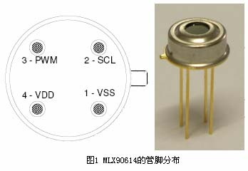

# 基于MLX90614红外非接触式的温度报警装置的设计

## **1 引言**

一般来说，测温方式可分为接触式和非接触式，接触式测温只能测量被测物体与测温传感器达到热平衡后的温度，所以响应时间长，且极易受环境温度的影响；而红外测温是根据被测物体的红外辐射能量来确定物体的温度，不与被测物体接触，具有影响动被测物体温度分布场，温度分辨率高、响应速度快、测温范围广、不受测温上限的限制、稳定性好等特点，近年来在家庭自动化、汽车电子、航空和军事上得到越来越广泛的应用。

MLX90614 系列模块是一组通用的红外测温模块。在出厂前该模块已进行校验及线性化，具有非接触、体积小、精度高，成本低等优点。被测目标温度和环境温度能通过单通道输出，并有两种输出接口，适合于汽车空调、室内暖气、家用电器、手持设备以及医疗设备应用等。本文以**MLX90614**为例介绍其原理和应用。

## **2 测温原理概述**

物体红外辐射能量的大小和波长的分布与其表面温度关系密切。因此，通过对物体自身红外辐射的测量，能准确地确定其表面温度，红外测温就是利用这一原理测量温度的。红外测温器由光学系统、光电探测器、信号放大器和信号处理及输出等部分组成。光学系统汇聚其视场内的目标红外辐射能量，视场的大小由测温仪的光学零件及其位置确定。红外能量聚焦在光电探测器上并转变为相应的电信号。该信号经过放大器和信号处理电路，并按照仪器内的算法和目标发射率校正后转变为被测目标的温度值。

**SMBus**（System Management Bus，）是 1995 年由 intel 公司提出的一种高效同步串行总线，SMBus 只有两根信号线:双向数据线和时钟信号线，容许 CPU 与各种外围接口器件以串行方式进行通信、交换信息，即可以提高传输速度也可以减小器件的资源占用，另外即使在没有SMBus 接口的单片机上也可利用软件进行模拟。

Melexis 公司生产的 MLX90614 系列测温模块是应用非常方便的红外测温装置，其所有的模块都在出厂前进行了校验，并且可以直接输出线性或准线性信号，具有很好的互换性，免去了复杂的校正过程。该模块以 81101 热电元件作为红外感应部分。输出是被测物体温度（$T_o$）与传感器自身温度（$T_a$）共同作用的结果，理想情况下热电元件的输出电压为：
$$
Vir=A(T_o^4-T_a^4)
$$
其中温度单位均为 Kelvin，A 为元件的灵敏度常数。

目标温度和环境温度由 81101 内置的热电偶测定测量，从 81101 中输出的两路温度信号分别经内部 MLX90302 器件上高性能、低噪声的斩波稳态放大器放大再经一个 17-bit 的模数转换器（ADC）和强大的数字信号处理(DSP)单元后输出。

 

该系列模块的温度解析度可达 0.01°C，体积小巧，被测目标和环境温度能通过单通道（由 MLX90302 内的状态机控制）输出，有两种输出方式：PWM 输出、可编程 SMBus 输出，适于多种应用环境，下面以 MLX90614 为例，重点介绍其特性和使用方法。

## **3 MLX90614** **简介**

### 3.1 MLX90614 管脚说明

| 名称  |             功能             |
| :---: | :--------------------------: |
|  VSS  | 电源地，金属外壳和该管脚相连 |
|  SCL  |     SMBus 接口的时钟信号     |
|  SDA  |     SMBus 接口的数据信号     |
|  VDD  |             电源             |

表 1 MLX90614管脚说明

### 3.2 MLX90614 SMBus 协议

图 3 读器件数据格式

多个MLX90614可以用于一个系统中，通过地址不同区分器件，器件默认的地址为5AH，因此在多 MLX90614 系统中，需要给每个 MLX90614 分配一个不同的地址，在只有一个MLX90614 的系统中，MLX90614 识别地址 00h，即在单个 MLX90614 系统中，可以使用该地址访问它。

发送和接收数据是以字节为单位进行的。每次发送一个字节（按位发送，发送 8 个位就是一个字节），然后就判断对方是否有应答，如果有应答，就接着发送下一个字节；如果没有应答，多次重发该字节，直到有应答，就接着发送下一个字节，如果多次重发后，仍然没有应答，就结束。接收数据时，每次接收一个字节（按位接收，接收 8 个位就是一个字节），然后向对方发送一个应答信号，然后就可以继续接收下一个字节。 

 

从MLX90614 种读出的数据是 16 位的，由高 8 位（DataH）和低 8 位（DataL）两部分组成，其中RAM地址 07H单元存储的是TOBJ1数据，数据范围从 0x27AD到 0x7FFF,表示的温度范围是-70.01℃到+382.19℃。

### 3.3 RAM 说明

用户不能向 RAM 写入数据，但是可以读一些存储单元。

| Name       | Address | Read Access |
| ---------- | ------- | ----------- |
| $T_A$      | 006h    | Yes         |
| $T_{OBJ1}$ | 007h    | Yes         |
| $T_{OBJ2}$ | 008h    | Yes         |

表2 RAM表

MLX90614 的RAM有 32 个 17 位存储单元，其中TA,TOBJ1,TOBJ2是环境温度和物体温度,在SMBus方式下，可以从这几个存储单元读出环境和被测物体的温度。

### 3.4 温度读取

通过0x07h和0x08h这两个寄存器组合来获取目标温度的完整数据，单位是**摄氏度**，温度值可以通过公式进行转换：
$$
T_{target}=((B_{high}<<8)|B_{low})\times0.02-273.15
$$
其中：

- 高字节是目标温度的高 8 位。
- 低字节是目标温度的低 8 位。
- 0.02 是每个 LSB（最低有效位）对应的温度增量。
- 273.15 是从开尔文到摄氏度的偏移。

## 4 电路原理图

图 4 电路原理图

## 6 实验结果

图 5 测温实验结果

## 参考文献

- [1] 郑贵林,刘丽莎. 基于MLX90614的非接触式测温仪[J]. 自动化与仪表,2014,29(10):12-15. DOI:10.3969/j.issn.1001-9944.2014.10.004.
- [2] 钟君,蔡黎明,于涌. 基于MLX90614的无线温度采集系统设计[J]. 传感器与微系统,2015,34(3):87-89,93. DOI:10.13873/J.1000-9787(2015)03-0087-03.
- [3] 郭志庭,陶军全. 基于STM32单片机和MLX90614传感器的红外测温仪设计[J]. 造纸装备及材料,2024,53(1):15-17. DOI:10.3969/j.issn.1672-3066.2024.01.005.
- [4] 高雪娟,董小倩,石萌,等. 基于MLX90614的智能体温安检系统[J]. 现代信息科技,2020,4(24):171-173,177. DOI:10.19850/j.cnki.2096-4706.2020.24.046.
- [5] 陈晓,江升. 基于MLX90614的开关柜测温传感器的设计[J]. 机电技术,2017(5):10-12. DOI:10.19508/j.cnki.1672-4801.2017.05.003.